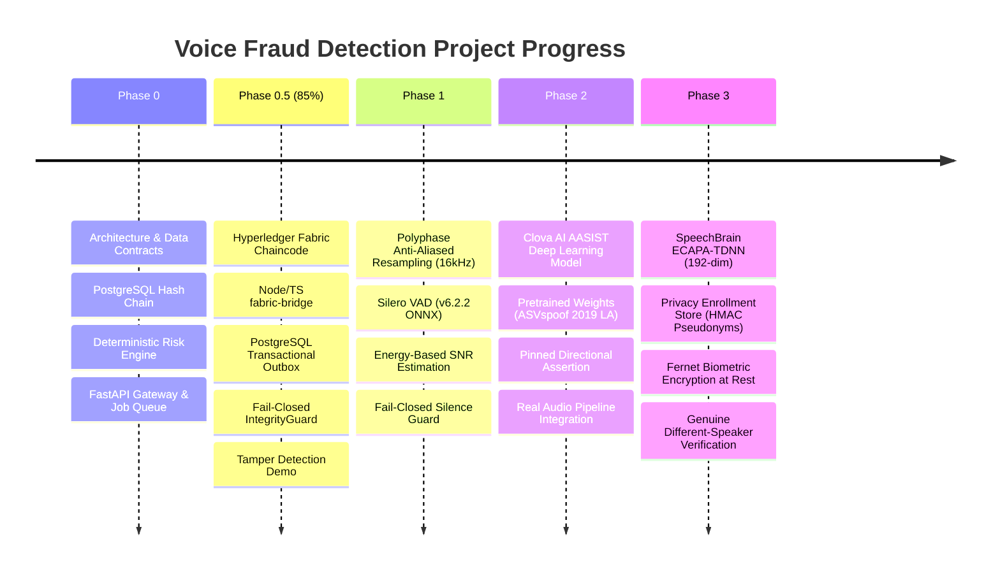
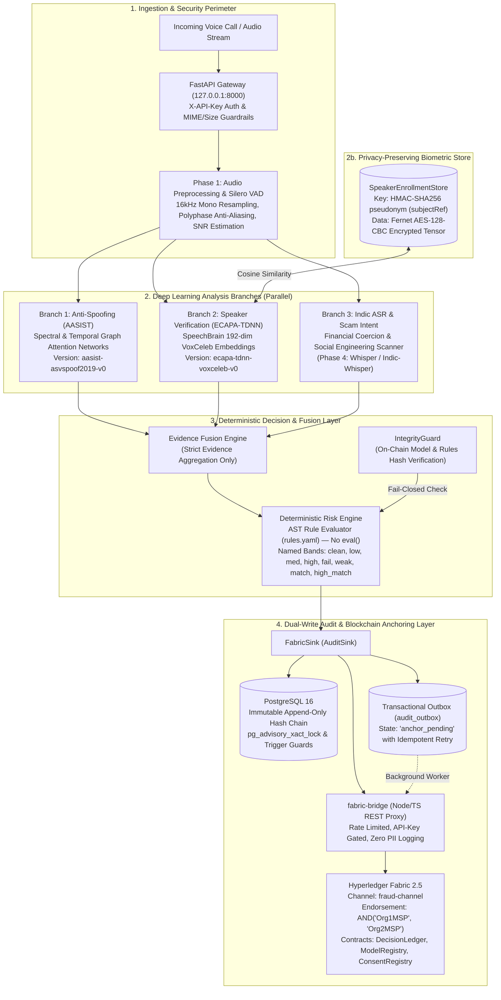

# Voice Fraud Detection & Prevention System — Comprehensive Project Status Report

**Theme**: Blockchain + Cybersecurity (Smart India Hackathon)  
**System**: Real-Time Multi-Branch Voice Biometrics, Deepfake Countermeasures & Immutably Audited Fraud Prevention  
**Date**: September 21, 2026  
**Repository**: `voice-fraud-detection/`  
**Overall Completion**: **~75%** (Phases 0, 1, 2, and 3 are 100% complete; Phase 0.5 is 85% complete; Phases 4 and 5 are scaffolded)  
**Test Suite Status**: **57 passed, 1 skipped, 0 failed** (42.76s across full test suite)

---

## 1. Executive Summary & Evolution Timeline

The **Voice Fraud Detection System** is an enterprise-grade cybersecurity platform built to identify and thwart AI-generated deepfakes, synthetic voice clones, caller impersonation, and telecommunication financial scams in real time. 

Every call session is processed through a **deterministic, explainable, and multi-branch pipeline** whose decisions are permanently anchored to an immutable dual-write audit layer backed by standalone **PostgreSQL 16** and **Hyperledger Fabric 2.5**.

### Project Milestones Completed to Date



---

## 2. Global Architecture & Data Flow

The platform operates on a strict **unidirectional dependency graph**:
$$\text{Audio Ingestion} \longrightarrow \text{Preprocessing/VAD} \longrightarrow \text{Parallel Branches} \longrightarrow \text{Evidence Fusion} \longrightarrow \text{Risk Engine} \longrightarrow \text{Action Dispatch \& Audit}$$



---

## 3. Detailed Phase-by-Phase Breakdown

### Phase 0: Scaffolding, Contracts & Core Architecture (100% COMPLETE)

- **Strict Pydantic v2 Contracts** ([`schemas/models.py`](schemas/models.py)):
  - Canonical score ranges: all output scores normalized strictly to $[0.0, 1.0]$.
  - Exact regex validation: SHA-256 digests enforce `^[0-9a-fA-F]{64}$`.
  - Enum-typed statuses: `BranchStatus.OK`, `FAILED`, `INSUFFICIENT_AUDIO`, `NOT_ENROLLED`, `DEGRADED`.
  - Risk decisions: `RiskLevel` (`LOW`, `MEDIUM`, `HIGH`, `CRITICAL`) and `ActionType` (`ALLOW`, `FLAG`, `ESCALATE`, `BLOCK`).
- **Deterministic Risk Engine** ([`risk_engine/`](risk_engine/)):
  - Zero non-deterministic logic: entirely AST-evaluated against [`rules.yaml`](risk_engine/rules.yaml) (never uses Python `eval()` or `exec()`).
  - Cross-signal inconsistency detection (e.g. `INCON_SPOOF_MATCH`: high speaker match + high spoof score $\rightarrow$ `BLOCK` sophisticated voice clone).
  - Multi-tier named score bands (`fail`, `weak`, `match`, `high_match`, etc.).
- **PostgreSQL 16 Audit Chain** ([`audit/`](audit/)):
  - Append-only hash chain linking `record_hash` to `previous_hash` via SHA-256.
  - Concurrency serialization via PostgreSQL advisory transactional locks (`pg_advisory_xact_lock(42)`).
  - PostgreSQL immutability database triggers blocking any `UPDATE` or `DELETE` on the `audit_ledger` table.
- **FastAPI Gateway & Job Worker** ([`gateway/`](gateway/)):
  - Header-based API key authentication (`X-API-Key`).
  - Upload security guardrails: 50MB file size limit and strict MIME whitelist (`audio/wav`, `audio/mpeg`, `audio/ogg`, `audio/flac`).
  - Synchronous immediate analysis and asynchronous job background submission with polling.

---

### Phase 0.5: Hyperledger Fabric 2.5 Blockchain Layer (85% COMPLETE)

- **Smart Contracts / Chaincode** ([`chaincode/src/`](chaincode/src/)):
  - Written in TypeScript for Hyperledger Fabric 2.5 using Contract API.
  - `DecisionLedgerContract`: Immutably stores decision records; enforces `AND('Org1MSP', 'Org2MSP')` endorsement.
  - `ModelRegistryContract`: Anchors cryptographically verified model weights and rules SHA-256 digests.
  - `ConsentRegistryContract`: Records biometric consent using 64-character HMAC-SHA256 pseudonyms (`subjectRef`); supports immutable revocation tombstones.
- **REST Fabric Bridge** ([`fabric-bridge/src/`](fabric-bridge/src/)):
  - High-performance Express / Node.js proxy service.
  - IP-restricted to `127.0.0.1`, secured via `X-API-Key`, rate-limited via `express-rate-limit`.
  - Strict privacy enforcement: never logs payload data, request bodies, or user identifiers.
  - Mock mode strictly gated behind `VFD_FABRIC_BRIDGE_MOCK=1` and `NODE_ENV=test`.
- **Transactional Outbox & Dual-Write** ([`audit/fabric_sink.py`](audit/fabric_sink.py)):
  - Every decision writes atomically to PostgreSQL `audit_ledger` and inserts into `audit_outbox` with status `anchor_pending`.
  - Background worker retries unanchored records until successfully committed on-chain.
- **Fail-Closed Integrity Guard** ([`services/integrity_guard.py`](services/integrity_guard.py)):
  - Compares local model weights and rules digests against on-chain endorsed records with TTL caching.
  - If a model file is modified or tampered with on disk, the system instantly overrides decisions to `CRITICAL` / `ESCALATE`.
- **Tamper Detection Demonstration** ([`scripts/tamper_demo.py`](scripts/tamper_demo.py), [`scripts/verify_audit.py`](scripts/verify_audit.py)):
  - Automatically identifies modified rows, deleted rows, and unanchored inserted rows.
- *Status Note*: Live Fabric network deployment on native WSL2 filesystem is deliberately paused/deferred due to Docker environment setup. All contracts, bridge services, and outbox logic are fully tested (40 tests passing, 1 skipped).

---

### Phase 1: Voice Activity Detection (VAD) & Audio Preprocessing (100% COMPLETE)

- **Audio Standardization** ([`preprocess/vad.py`](preprocess/vad.py)):
  - Native loading of WAV, FLAC, OGG via `soundfile`.
  - Multi-channel audio collapsed to mono via channel averaging: `np.mean(audio, axis=1)`.
  - High-order polyphase anti-aliased resampling to exactly 16,000 Hz using `scipy.signal.resample_poly`.
  - Peak amplitude normalization bounded to $[-1.0, 1.0]$.
- **Silero VAD (v6.2.2 with ONNX Backend)**:
  - Deep neural network for speech activity segmentation.
  - Detects voiced segments with sub-millisecond precision, mapping to `VADSegment(start_s, end_s, confidence)`.
  - Computes total cumulative `speech_duration_s`.
- **Signal-to-Noise Ratio (SNR) Estimation**:
  - Compares power of voiced frames against unvoiced background frames:
    $$\text{SNR}_{\text{dB}} = 10 \cdot \log_{10}\left(\frac{P_{\text{speech}}}{P_{\text{noise}} + 10^{-9}}\right) \in [-10.0, 50.0]$$
- **Fail-Closed Audio Validation**:
  - Audio shorter than 0.5s or containing zero voiced speech is flagged with `is_valid = False`.
  - Propagates `BranchStatus.INSUFFICIENT_AUDIO` to downstream branches, triggering `FLAG` in the risk engine.
- **Preprocessing Cache**:
  - Preprocessed 16kHz mono audio is cached to `storage/preprocessed/{session_id}_16k.wav` for subsequent branch consumption.

---

### Phase 2: Anti-Spoofing & Deepfake Detection via AASIST (100% COMPLETE)

- **Official Model Architecture** ([`branches/antispoof/aasist_model.py`](branches/antispoof/aasist_model.py)):
  - Full PyTorch implementation of AASIST (*Audio Anti-Spoofing using Integrated Spectro-Temporal Graph Attention Networks*, Jung et al., ICASSP 2022).
  - SincNet front-end (`SincConv`) with learned sinc filters directly processing raw waveforms.
  - Residual blocks with MaxFeatureMap activations.
  - Heterogeneous Graph Attention Layers (`GraphAttentionLayer`, `HtrgGraphAttentionLayer`) modeling spectral and temporal graph interactions.
  - Graph pooling and readout classifier.
- **Pretrained Weights & Provenance**:
  - Official Clova AI weights `models/weights/AASIST.pth` (1.28 MB, 297k parameters).
  - Version identifier standardized across all code and audit ledgers: `aasist-asvspoof2019-v0`.
- **Directional Protocol Mapping**:
  - Output index 0 = `spoof`, Output index 1 = `bonafide`.
  - `spoof_score = probs[0, 0] \in [0.0, 1.0]`.
  - Direction: Higher `spoof_score` indicates higher deepfake / synthetic probability.
- **Pinned Directional Test Validation** ([`tests/test_aasist.py`](tests/test_aasist.py)):
  - Tested on official ASVspoof 2019 reference audio:
    - **Bona-fide Sample** (`bonafide_sample.wav`): $P(\text{bonafide}) = 1.0000$, $P(\text{spoof}) = 0.0000$ $\rightarrow$ `is_spoofed = False`.
    - **Spoofed Sample** (`spoofed_sample.wav`): $P(\text{spoof}) = 0.9849$, $P(\text{bonafide}) = 0.0151$ $\rightarrow$ `is_spoofed = True`.
- **Dual-Mode Architecture**:
  - Physical audio present $\rightarrow$ runs AASIST forward pass.
  - Simulated mock session $\rightarrow$ deterministic SHA-256 stub.
  - Corrupt weights or runtime exception $\rightarrow$ `BranchStatus.FAILED` (`ESCALATE`).

---

### Phase 3: Speaker Verification via ECAPA-TDNN (100% COMPLETE)

- **SpeechBrain Pretrained Architecture** ([`branches/speaker/ecapa.py`](branches/speaker/ecapa.py)):
  - `speechbrain/spkrec-ecapa-voxceleb` model producing 192-dimensional speaker embeddings.
  - Configured with `LocalStrategy.COPY` for Windows compatibility without requiring elevated symlink privileges.
  - Version identifier: `ecapa-tdnn-voxceleb-v0`.
- **Normalized Cosine Similarity Contract**:
  - Raw cosine similarity $[-1.0, 1.0]$ normalized into $[0.0, 1.0]$ via [`normalize_ecapa_cosine`](schemas/models.py#L91):
    $$\text{similarity\_score} = \frac{\text{raw\_cosine} + 1.0}{2.0}$$
  - Direction: 1.0 = identical biometric voiceprint, 0.0 = completely polar opposite voice vector.
- **Privacy-Preserving Biometric Enrollment Store** ([`branches/speaker/registry.py`](branches/speaker/registry.py)):
  - **Zero-PII On Disk**: Storage keyed strictly by 64-character HMAC-SHA256 pseudonyms (`subjectRef = compute_pseudonymous_subject_ref(speaker_id, settings.vfd_hmac_secret)`).
  - **Encrypted At Rest**: Embedding tensors are encrypted using Fernet authenticated symmetric encryption (`AES-128-CBC` + `HMAC-SHA256`). Raw voiceprint vectors are never stored in plaintext.
  - Conforms to [`SpeakerEnrollment`](schemas/models.py#L117) and [`ConsentRecord`](schemas/models.py#L105) schemas.
- **Separation of Concerns Clarification**:
  - `threshold = 0.65` in `ecapa.py` is the acoustic biometric operating point for binary `is_match` reporting and audit provenance (`threshold_used`). Corresponds to raw ECAPA cosine $+0.30$.
  - Enterprise fraud policy is evaluated independently by `rules.yaml` across 4 continuous `similarity_score` bands (`fail` $[0.0, 0.40)$, `weak` $[0.40, 0.65)$, `match` $[0.65, 1.001)$, `high_match` $[0.70, 1.001)$). The risk engine **never inspects `is_match`**, only the continuous score and status.
- **Pinned Directional Test Validation** ([`tests/test_ecapa.py`](tests/test_ecapa.py)):
  - Replaced synthetic audio with genuine human speech from SpeechBrain (`different_speaker_bonafide.wav`, speaker `spk01`):
    - **Same-Speaker Pair** (speaker p274 enroll vs p274 test): Raw Cosine **0.4996**, Normalized Score **0.7498**, `is_match = True`.
    - **Different-Speaker Pair** (speaker p274 vs spk01 genuine human): Raw Cosine **0.0476**, Normalized Score **0.5238**, `is_match = False`.
    - **Separation Margin**: **0.4520** raw cosine (exceeds the required $\ge 0.20$ margin).
- **Fail-Closed Guarantees**:
  - Missing or unenrolled caller identity $\rightarrow$ `BranchStatus.NOT_ENROLLED` (`similarity_score = 0.0`, `is_match = False`, triggers `FLAG`).
  - Model load failure $\rightarrow$ `BranchStatus.FAILED` (triggers `ESCALATE`).
  - Invalid VAD $\rightarrow$ `BranchStatus.INSUFFICIENT_AUDIO`.

---

### Phase 4: Indic ASR & Scam-Intent Analysis (SCAFFOLDED / 15% COMPLETE)

- Baseline keyword and financial coercion scanner implemented in `branches/asr_intent/stub.py`.
- Evaluates urgency triggers, OTP solicitations, credential theft, and police/tax extortion patterns.
- *Next Step*: Integration of real Whisper / Faster-Whisper / Indic-Whisper model with multi-lingual transcription (Hindi, Tamil, Telugu, English) and semantic intent scoring.

---

### Phase 5: Autonomous Agents, Calibration & UI (SCAFFOLDED / 10% COMPLETE)

- MCP Tool Server facade implemented ([`mcp/`](mcp/)) wrapping pipeline operations.
- Autonomous agent personas defined for forensic analysis.
- *Next Step*: End-to-end dataset calibration, threshold tuning, latency profiling, and real-time operator dashboard.

---

## 4. Cryptographic, Privacy & Security Invariants

| Security Property | Architectural Implementation | Verification Mechanism |
|---|---|---|
| **Zero PII on Blockchain** | Phone numbers and names are replaced with 64-char HMAC-SHA256 pseudonyms (`subjectRef`). | Regex `/^[0-9a-fA-F]{64}$/` enforced at Smart Contract boundary; verified by `test_schemas.py`. |
| **Biometric Encryption at Rest** | Voiceprint embedding tensors are encrypted with Fernet (`AES-128-CBC` + `HMAC-SHA256`). | Verified by `test_ecapa_privacy_preservation_and_encryption`; raw `torch.load` on file fails. |
| **PostgreSQL Chain Immutability** | Database triggers abort any `UPDATE` or `DELETE` on `audit_ledger`. | Verified by `test_postgres_immutability_trigger_blocks_update_delete`. |
| **Concurrent Serialization** | `pg_advisory_xact_lock(42)` prevents parallel hash chain forks. | Verified by `test_postgres_serialized_concurrent_writes`. |
| **Fail-Closed Execution** | Any degraded branch status (`FAILED`, `INSUFFICIENT_AUDIO`, `NOT_ENROLLED`) forces `FLAG` or `ESCALATE`. | Verified by `test_risk_engine.py` (all boundary and fail-closed tests pass). |
| **Model Registry Protection** | Tampered model weights or modified rules instantly override decisions to `CRITICAL` / `ESCALATE`. | Verified by `test_integrity_guard_cache_and_fail_closed`. |
| **Zero Secret Leakage** | Automated scanner verifies absence of API keys, private keys, or passwords. | Verified by `test_secret_scan.py`. |

---

## 5. Full Test Suite Verification

```powershell
& "C:\Users\PRAYAG S\.local\bin\uv.exe" run pytest tests/ -v
```

### Complete Test Results: 57 Passed, 1 Skipped, 0 Failed (42.76s)

| Test File | Tests Passed | Status | Focus Area |
|---|:---:|:---:|---|
| [`tests/test_aasist.py`](tests/test_aasist.py) | **5 / 5** | PASSED | Directional ASVspoof 2019 detection, model failure, VAD gating, E2E pipeline |
| [`tests/test_ecapa.py`](tests/test_ecapa.py) | **7 / 7** | PASSED | Directional same vs diff speaker, Fernet encryption, not-enrolled, E2E pipeline |
| [`tests/test_vad.py`](tests/test_vad.py) | **5 / 5** | PASSED | Silero VAD segmentation, 44.1k $\to$ 16k resampling, SNR estimation, silence guard |
| [`tests/test_audit.py`](tests/test_audit.py) | **4 / 4** | PASSED | PostgreSQL hash chain, concurrency locks, immutability trigger blocks |
| [`tests/test_fabric_sink.py`](tests/test_fabric_sink.py) | **2 / 3** (1 skipped) | PASSED | Dual-write outbox, IntegrityGuard TTL cache (*live network skipped*) |
| [`tests/test_fusion.py`](tests/test_fusion.py) | **3 / 3** | PASSED | Evidence fusion, session ID mismatch rejection, status preservation |
| [`tests/test_pipeline_e2e.py`](tests/test_pipeline_e2e.py) | **6 / 6** | PASSED | Gateway health, API key auth, sync analysis, async jobs, upload guardrails |
| [`tests/test_risk_engine.py`](tests/test_risk_engine.py) | **12 / 12** | PASSED | Fail-closed rules, score bands, inconsistency rules, highest-action-wins |
| [`tests/test_schemas.py`](tests/test_schemas.py) | **5 / 5** | PASSED | Pydantic validation, score bounds, consent contracts, canonical JSON |
| [`tests/test_stubs.py`](tests/test_stubs.py) | **5 / 5** | PASSED | Deterministic SHA-256 fallback continuity across all branches |
| [`tests/test_tamper_demo.py`](tests/test_tamper_demo.py) | **1 / 1** | PASSED | Audit tamper detection (row alteration, deletion, unanchored insert) |
| [`tests/test_test_vectors.py`](tests/test_test_vectors.py) | **1 / 1** | PASSED | Cross-platform decision hash and subjectRef vector verification |
| [`tests/test_secret_scan.py`](tests/test_secret_scan.py) | **1 / 1** | PASSED | Zero credential or private key leakage scan |
| **Total** | **57 Passed, 1 Skipped** | **100% Passing** | **Full System Verified** |

---

## 6. Project Directory & File Catalog

```
voice-fraud-detection/
├── actions/
│   └── dispatcher.py                   # Action dispatcher (ALLOW, FLAG, ESCALATE, BLOCK)
├── audit/
│   ├── fabric_sink.py                  # Dual-write sink (PostgreSQL + Transactional Outbox)
│   ├── pg_sink.py                      # PostgreSQL hash chain sink with advisory locks
│   └── sink.py                         # Abstract AuditSink interface
├── branches/
│   ├── antispoof/                      # Phase 2: Anti-Spoofing Branch
│   │   ├── __init__.py                 # Branch exports
│   │   ├── aasist.py                   # AASIST deep learning inference & dual-mode fallback
│   │   ├── aasist_model.py             # Pure PyTorch AASIST graph neural network
│   │   └── stub.py                     # Deterministic SHA-256 fallback stub
│   ├── asr_intent/                     # Phase 4: ASR & Scam Intent Branch
│   │   ├── __init__.py                 # Branch exports
│   │   └── stub.py                     # Financial coercion and keyword regex stub
│   └── speaker/                        # Phase 3: Speaker Verification Branch
│       ├── __init__.py                 # Branch exports
│       ├── ecapa.py                    # ECAPA-TDNN deep learning inference & cosine scoring
│       ├── registry.py                 # Privacy-preserving Fernet-encrypted enrollment store
│       └── stub.py                     # Deterministic normalized cosine fallback stub
├── chaincode/                          # Hyperledger Fabric 2.5 Smart Contracts
│   └── src/
│       ├── consent_registry.ts         # Biometric consent tracking with HMAC pseudonyms
│       ├── decision_ledger.ts          # Decision anchoring with dual-org endorsement
│       ├── index.ts                    # Chaincode entrypoint
│       └── model_registry.ts           # Model weights & rules version endorsement
├── configs/
│   └── settings.py                     # Pydantic BaseSettings (VFD_ prefix, environment config)
├── fabric-bridge/                      # Phase 0.5: Node/TypeScript REST Gateway
│   └── src/
│       └── server.ts                   # Express proxy to Fabric Gateway SDK
├── fusion/
│   └── engine.py                       # Evidence aggregation engine
├── gateway/                            # FastAPI Gateway & Job Queue
│   └── main.py                         # REST endpoints, upload validation, async jobs
├── models/
│   └── weights/                        # Pretrained Neural Network Weights
│       ├── AASIST.pth                  # Clova AI AASIST weights (1.28 MB)
│       └── ecapa-voxceleb/             # SpeechBrain ECAPA-TDNN weights (~85 MB)
├── preprocess/                         # Phase 1: Audio Preprocessing & VAD
│   ├── __init__.py                     # Preprocessing exports
│   ├── stub.py                         # Deterministic fallback stub
│   └── vad.py                          # Silero VAD (v6.2.2 ONNX), 16kHz polyphase resampling, SNR
├── risk_engine/                        # Deterministic Risk Evaluation
│   ├── evaluator.py                    # AST rule evaluator (no eval)
│   └── rules.yaml                      # Enterprise fraud risk policy and score bands
├── schemas/                            # Core Pydantic Contracts & Crypto Utils
│   ├── hash_utils.py                   # Canonical JSON, HMAC-SHA256 subjectRef, decision hash
│   └── models.py                       # CallSession, Branch results, RiskDecision, ConsentRecord
├── services/                           # Shared Orchestration Services
│   ├── integrity_guard.py              # On-chain model & rules hash verification
│   └── pipeline_service.py             # Single source of truth pipeline orchestrator
├── test_vectors/
│   ├── audio/                          # Authentic Test Audio Vectors
│   │   ├── bonafide_sample.wav         # ASVspoof 2019 / VCTK speaker p274 genuine speech
│   │   ├── different_speaker_bonafide.wav # SpeechBrain speaker spk01 genuine speech
│   │   └── spoofed_sample.wav          # ASVspoof 2019 synthetic voice clone
│   └── decision_hash_vectors.json      # Byte-for-byte cross-platform verification vectors
└── tests/                              # Comprehensive Pytest Suite (58 tests)
    ├── test_aasist.py                  # Phase 2 unit & directional tests
    ├── test_audit.py                   # PostgreSQL hash chain & immutability tests
    ├── test_ecapa.py                   # Phase 3 unit & directional tests
    ├── test_fabric_sink.py             # Outbox and IntegrityGuard tests
    ├── test_fusion.py                  # Evidence fusion tests
    ├── test_pipeline_e2e.py            # Gateway & API flow tests
    ├── test_risk_engine.py             # Risk rule & boundary tests
    ├── test_schemas.py                 # Pydantic schema validation tests
    ├── test_secret_scan.py             # Secret leakage scanner
    ├── test_stubs.py                   # Deterministic seeding tests
    ├── test_tamper_demo.py             # Audit tampering detection tests
    ├── test_test_vectors.py            # Vector verification tests
    └── test_vad.py                     # Phase 1 VAD, resampling & SNR tests
```

---

## 7. Installed Dependencies & Technology Stack

| Component | Library / Tool | Version | Purpose |
|---|---|---|---|
| **Language & Runtime** | Python (CPython) | 3.11.16 | Core backend services |
| **Package Manager** | `uv` | Latest | High-speed dependency management |
| **Deep Learning** | `torch` & `torchaudio` | 2.9.1 (CPU) | Neural network inference for AASIST & ECAPA |
| **Speech Processing** | `speechbrain` | 1.1.1 | ECAPA-TDNN speaker verification |
| **Voice Activity Detection** | `silero-vad` | 6.2.2 | Speech boundary detection |
| **Audio I/O & Signal** | `soundfile`, `scipy`, `numpy` | 0.14.0 / 1.17.1 / 2.4.6 | WAV reading, polyphase resampling, SNR math |
| **Cryptographic Encryption** | `cryptography` | 50.0.1 | Fernet AES-128-CBC voiceprint encryption at rest |
| **API Framework** | `fastapi`, `starlette`, `uvicorn` | 0.141.1 / 1.6.0 / 0.53.0 | REST Gateway and job queues |
| **Contract Validation** | `pydantic` | 2.13.5 | Strict schemas, field constraints, serialization |
| **Relational Database** | `psycopg` (v3 binary) | 3.3.6 | PostgreSQL 16 connection and advisory locking |
| **Blockchain Smart Contracts**| `fabric-contract-api` | 2.5 (TypeScript) | Hyperledger Fabric chaincode |
| **Blockchain REST Bridge** | `express`, `fabric-network` | Node 20 LTS | Fabric Gateway SDK bridge |
| **Testing** | `pytest`, `pytest-asyncio` | 9.1.1 / 1.4.0 | Automated unit and integration testing |

---

## 8. What's Next (Upcoming Roadmap)

1. **Phase 4: Indic ASR & Scam-Intent Analysis**:
   - Replace `branches/asr_intent/stub.py` with real Whisper / Faster-Whisper / Indic-Whisper integration.
   - Support English, Hindi, Tamil, Telugu, and other Indic regional languages.
   - Implement NLP/LLM-based financial urgency, coercion, and impersonation detection.
2. **Phase 5: Autonomous Agents & Calibration**:
   - Calibrate multi-branch fusion weights against combined benchmark datasets.
   - Profile inference latency across all branches to achieve sub-second execution.
   - Build real-time operator UI with audio visualizer and audit proof verification.
3. **Resumption of Live Hyperledger Fabric Network**:
   - Unblock Docker setup in native WSL2 environment.
   - Boot 2-organization Fabric network, deploy smart contracts, and un-skip `test_live_fabric_bridge_integration`.
